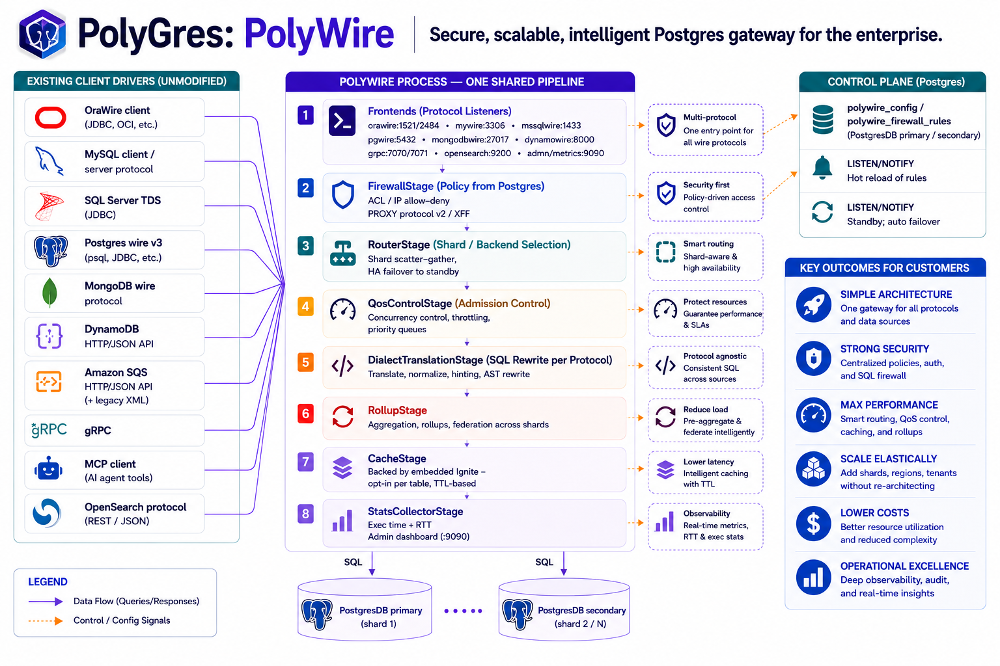
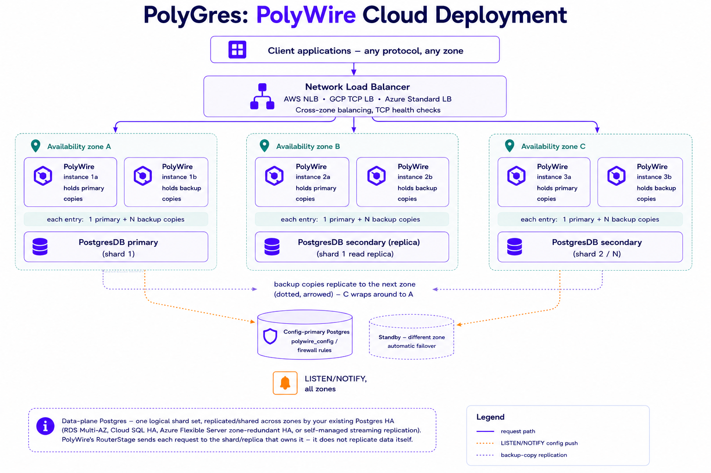

# Nexagres — Docker

Public packaging and documentation for the Nexagres project's two tools: **PolyAdvisor**
(migration assessment) and **PolyWire** (protocol gateway). Their source repos are private; this
repo is the public surface — prebuilt images, architecture, and how to run them.

## What's here

| Tool | What it does | Image |
|---|---|---|
| **PolyAdvisor** | Connects to an Oracle/MySQL/MariaDB/SQL Server database (or takes an uploaded performance report) and scores how hard it'd be to migrate to Postgres, plus a sizing recommendation. | `ghcr.io/polygres26/polyadvisor` |
| **PolyWire** | A mid-tier gateway that speaks Oracle, MySQL, SQL Server, Postgres, MongoDB, DynamoDB, and Amazon SQS wire protocols on one side and real Postgres on the other — so an existing app keeps its driver and connection code while the data lives in Postgres. | `ghcr.io/polygres26/polywire` |

## Run PolyAdvisor

```bash
docker run -p 8090:8090 -v polyadvisor-data:/data ghcr.io/polygres26/polyadvisor:latest
```

Open `http://localhost:8090`. State (saved connections, LLM config, uploaded reports) persists in
the `polyadvisor-data` volume across restarts.

## Run PolyWire

```bash
docker run \
  -p 15432:15432 -p 13306:13306 -p 11521:11521 -p 14333:14333 -p 27017:27017 \
  -p 18000:18000 -p 9324:9324 -p 7070:7070 -p 19090:19090 \
  -e POLYWIRE_HOST=<your-postgres-host> \
  -e POLYWIRE_PORT=5432 \
  -e POLYWIRE_DATABASE=postgres \
  -e POLYWIRE_USER=postgres \
  -e POLYWIRE_PASSWORD=<password> \
  ghcr.io/polygres26/polywire:latest
```

Point it at a real Postgres backend via `POLYWIRE_*`. Every other setting is an env var with a
documented default — see `polywire/README.md` in this repo for the full port list and
configuration reference. The admin app (Metrics, Topology, SQL Firewall, ACL, OAuth, LLM
configuration, and more) is baked into the image and served on port `19090` — no separate setup
needed, just open it in a browser.

## Architecture



## Multi-AZ deployment



Every piece of this diagram is real and tested today: the load balancer fan-out, per-zone
instance scaling, config-primary failover, and the cross-zone cache backup replication — a cache
entry's backup copy is placed on a node in a different availability zone than its primary,
proven by a live test with three real cache nodes, not a simulation. Cluster discovery works
across a static seed list or AWS S3/GCP Cloud Storage/Azure Blob Storage; connections between
cache nodes can be TLS-encrypted. What's still open: the cloud discovery modes are verified
against the real client libraries but not yet exercised against real cloud storage (no cloud
credentials available to test with), and each node's zone is operator-supplied rather than
auto-detected.

## Verify it works

`tests/` has basic smoke tests for every wire protocol — real client libraries (Python and Java),
running against these published images directly, no source checkout required. See
[`tests/README.md`](tests/README.md).

## Image packaging reference

`polywire/` and `polyadvisor/` in this repo hold the actual `Dockerfile`s and `docker-compose.yml`s
these images are built from, plus their own module-specific docs (build stages, configuration,
data persistence). They won't build standalone from this repo alone — the Dockerfiles `COPY` from
`wire/` and `advisor/`, which live in Nexagres's private source repos — they're included here for
transparency into exactly how each image is put together, not as a build-it-yourself path.

## License

MIT — see each image's own repo for details.
